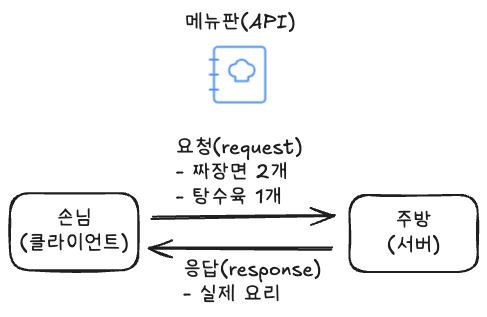

# 1. API, 왜 필요한가요?


## 1-1. API란 무엇인가요?

API는 **웹 서비스에서 데이터를 주고받기 위한 규칙이나 도구**입니다.
Application Programming Interface 의 줄임말이며, 애플리케이션 프로그래밍(우리 서비스)이 외부 손님과 어떻게 의사소통할지 정해주는 명세서(인터페이스)라고 생각하시면 됩니다.

API는 식당의 메뉴판 같은 거예요. 식당에 가서 밥을 먹고 싶을 때, 우리 손님(클라이언트)은 메뉴판(API)에 있는 음식(데이터나 기능)을 주문하죠. 메뉴판에는 어떤 음식을 어떻게 주문할 수 있는지 규칙이 적혀 있고, 종업원은 그 규칙대로 주방(서버)에 요청을 전달해 음식을 가져다줍니다. 

마찬가지로 API는 프로그램끼리 "이런 데이터나 기능을 이런 방식으로 달라"고 요청하고 받을 수 있게 해주는 규칙이에요. 복잡한 주방(서버) 내부를 몰라도 메뉴판(API)만 알면 원하는 걸 얻을 수 있습니다.



"서버가 API 를 제공한다" 라는 말은 곧, "식당(주방)에서 메뉴판을 제공한다" 라고 이해하시면 됩니다.


## 1-2. HTTP란 무엇인가요?

사실 위 그림에 나오는 흐름은 HTTP 요청, 응답을 나타낸 것입니다. HTTP 는 인터넷에서 오고가는 통신의 규칙(프로토콜) 중 하나입니다.
Hypertext Transfer Protocol 의 줄임말로, **웹 브라우저와 서버가 하이퍼텍스트, 즉 웹 페이지의 내용을 주고받을 때 사용하는 규칙**입니다

#### HTTP의 작동 방식

**웹 브라우저가 서버에 요청을 보내고, 서버가 그 요청에 대한 응답을 반환하는 방식**으로 작동합니다. 

예를 들어, 웹사이트를 방문하면 브라우저가 서버에 페이지를 요청하고, 서버는 해당 페이지의 내용(HTML, **JSON** 등의 파일)을 반환합니다.
즉, 손님이 주방에게 주문하면 요리를 내어주는 것과 같이, 브라우저(크롬 등)가 서버에게 HTTP 요청을하면 그에 맞는 응답을 해주게 됩니다.

#### HTTP의 주요 특징

**클라이언트-서버 모델**: 웹 브라우저(클라이언트)가 요청을 보내고, 서버가 응답을 반환하는 구조입니다. 

**비연결성(Connectionless)**: HTTP 요청이 완료되면 클라이언트와 서버 연결은 유지되지 않고 종료됩니다. 즉, 한 번의 요청이 1회성이라고 생각해주시면 됩니다.

**무상태성(Stateless)**: 클라이언트 또는 서버는 이전 요청의 상태를 기억(저장)하지 않습니다. 


## 1-3. 실제 예시로 이해하기

**쇼핑몰 상품 보기**

```yaml
GET http://shoppingmall.com/api/products
```
- 이 주소로 요청을 보내면 상품 목록을 받아올 수 있습니다.
- 서버는 상품 목록을 응답하도록 미리 구현해야 합니다.


**트위터 글 쓰기**

```yaml
POST http://twitter.com/api/posts
```
- 이 주소로 새로운 게시물을 작성할 수 있습니다.
- 서버는 게시물을 저장하도록 미리 구현해야 합니다.


## 1-4. REST API란 무엇이고, 왜 좋을까요?

### REST API란?

REST API는 **웹에서 데이터를 주고받기 위한 규칙**입니다.
(REST는 "Representational State Transfer"의 줄임말로 서버에 있는 자원의 정보(상태)를 클라이언트에게 전달하는 방식이라고 생각하시면 됩니다.)

우리는 웹에서 주소(URL)를 입력해서 페이지를 여는 것처럼, REST API는 **특정한 주소와 방식을 조합해서 서버와 소통**할 수 있습니다.


### REST API의 기본 규칙 (꼭 알아야 할 핵심 4가지)

1. **자원(Resource)은 URL로 표현한다**

   URL은 어떤 "데이터"를 요청하는지를 나타내야 합니다.

   예: `/api/products`는 "상품"이라는 자원을 의미합니다.

2. **행동(Action)은 HTTP 메서드로 표현한다**

   어떤 동작을 할지 정해진 방식으로 표현합니다.

   - `GET` : 가져오기 (조회)
   - `POST` : 새로 만들기 (등록)
   - `PUT` : 수정하기 (전체 수정)
   - `PATCH` : 일부 수정하기
   - `DELETE` : 삭제하기

3. **자원에는 명사를 사용하고, 동사는 쓰지 않는다**

   `GET /api/getProducts` 는 동사를 사용하므로 추천하지 않고,

   `GET /api/products` 는 명사를 자원으로 사용하므로 이렇게 사용하는 것을 추천합니다.

4. **서버는 요청 결과에 따라 적절한 HTTP 상태 코드를 반환해야 한다**

   웹 개발자가 자주 사용하는 HTTP 상태 코드입니다.

   - `200 OK` : 요청 성공
   - `201 Created` : 생성 성공
   - `400 Bad Request` : 잘못된 요청
   - `401 Unauthorized` : 인증 실패
   - `404 Not Found` : 자원 없음
   - `500 Internal Server Error` : 서버 에러 등

   400번대 에러는 주로 클라이언트가 규칙을 위반했을 경우를 말하며, 500에러는 서버 내부에 문제가 있을 때를 말합니다.

   백엔드 개발자는 500 에러 발생시 적절한 대응을 꼭 해주는게 바람직합니다.


### 쇼핑몰 상품 목록 보기 예시 (상세)

#### 1. 클라이언트 → 서버 : **HTTP 요청**

```yaml
GET /api/products HTTP/1.1
Host: shoppingmall.com
Accept: application/json
```

#### 2. 서버 → 클라이언트 : **HTTP 응답**

```yaml
HTTP/1.1 200 OK
Content-Type: application/json

[
  {
    "id": 1,
    "name": "무선 이어폰",
    "price": 129000,
    "stock": 23
  },
  {
    "id": 2,
    "name": "게이밍 키보드",
    "price": 79000,
    "stock": 12
  }
]
```

클라이언트가 `/api/products`에 GET 요청을 보내면, 서버는 상품 목록(JSON 형식)을 응답합니다.


### 트위터 글 쓰기 예시 (상세)

#### 1. 클라이언트 → 서버 : **HTTP 요청**

```yaml
POST /api/posts HTTP/1.1
Host: twitter.com
Content-Type: application/json

{
  "author": "apiece",
  "content": "오늘 날씨 너무 좋다 ☀️",
  "timestamp": "2025-04-20T14:23:00Z"
}
```

#### 2. 서버 → 클라이언트 : **HTTP 응답**

```yaml
HTTP/1.1 201 Created
Content-Type: application/json

{
  "id": 101,
  "author": "apiece",
  "content": "오늘 날씨 너무 좋다 ☀️",
  "timestamp": "2025-04-20T14:23:00Z"
}
```

클라이언트가 `/api/posts`에 게시글 데이터를 담아 POST 요청을 보내면, 서버는 그 글을 저장하고 저장된 정보를 JSON 형식으로 응답합니다. 응답 상태 코드 `201 Created`는 "요청에 따라 자원이 성공적으로 생성되었음"을 의미합니다.


> ### 💡 JSON이란?
>
> JSON은 JavaScript Object Notation의 줄임말로, **데이터를 주고받기 위한 약속된 형식**입니다.
>
> `"이름": "값"` 구조로 깔끔하게 정리할 수 있습니다. 이렇게 키-값(key-value) 쌍으로 나타내어 정보를 쉽고 빠르게 확인할 수 있습니다.
>
> 위에 있는 예시처럼 직관적으로 사람이 이해하기 좋은 형식이어서 웹 개발에서 많이 사용됩니다.


### REST API의 버전 관리

API는 한 번 만들어지면 여러 사용자나 서비스가 사용하게 됩니다. 그런데 시간이 지나면서 구조를 바꾸거나 기능을 개선하고 싶을 때가 생기죠.
이때 **기존 사용자에게 영향을 주지 않으면서 새로운 기능을 추가하려면, 버전 관리**를 하면 도움이 많이 됩니다.
특히, 내부 전용 API 가 아닌 외부에 공개되는 API 라면 버전을 통해 안전하게 API를 관리할 수 있습니다.

> 예:
>
> - `GET /api/v1/products` → 기존 방식
> - `GET /api/v2/products` → 새롭게 바뀐 방식

이렇게 하면 기존 사용자에게 오류 없이 서비스 유지 가능함과 동시에, 새로운 API 설계도 자유롭게 실험 가능하고 안전하게 배포가 가능합니다.


### REST API의 장점

**웹의 언어를 그대로 활용한 쉬운 소통 방식**

REST는 웹의 기본 언어인 HTTP를 그대로 사용합니다. 예를 들어 새로운 나라에 갔는데, 그 나라 사람들이 모두 영어를 사용한다면 의사소통이 훨씬 쉬워지겠죠? REST는 그런 느낌입니다.

**다양한 기기와 환경에서도 일관된 접근 방식**

REST API는 스마트폰, 태블릿, 웹사이트 등 다양한 기기와 환경에서 동일한 방식으로 사용할 수 있습니다. 이는 개발자들이 한 번 만든 API를 여러 플랫폼에서 재사용할 수 있게 해주어, 개발 효율성을 높여줍니다.
예를 들어 USB 포트처럼, 어떤 기기든 USB를 지원하면 동일한 케이블로 연결할 수 있듯이, REST API도 다양한 환경에서 동일한 방식으로 작동합니다.

